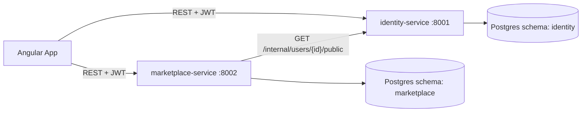

# SkillVerse — Microservices Architecture (Week 5)

## Service boundaries and ownership

| Service | Port | Owns tables | Modules |
|---|---|---|---|
| **identity-service** | 8001 | `users`, `profiles`, `wallets`, `transactions` | auth, users, profiles, wallets, transactions |
| **marketplace-service** | 8002 | `skills`, `bookings`, `reviews` | skills, bookings, reviews, training |

Split along the seam that already existed in the original monolith's
import graph: `bookings`/`skills`/`reviews` were already coupled to each
other and to `users`/`profiles` display data, while
`wallets`/`transactions` were a self-contained financial pair.
identity-service owns "who is this person and their money";
marketplace-service owns "what's being taught, booked, and reviewed."

## Diagram

## Authentication: stateless JWT, shared secret

Both services sign/verify JWTs with the same `SECRET_KEY`.
identity-service issues tokens (`/auth/login`) and, since it still owns
`users`, its `get_current_user` does a real DB lookup on every request —
that's accurate and cheap because it's a local table.

marketplace-service has no `users` table, so it verifies the JWT
signature and reads `sub`/`role` directly from the token claims
(`CurrentUser` in `app/core/dependencies.py`) instead of calling
identity-service to check who's logged in. This was verified directly:
marketplace-service correctly accepted an identity-service-issued JWT
and enforced authorization **even with identity-service turned off**.

Trade-off: a user's role change on identity-service doesn't take effect
in marketplace-service until they get a new token (`ACCESS_TOKEN_EXPIRE_MINUTES`
bounds the staleness window). Accepted for this scope — the alternative
(check with identity-service on every request) would reintroduce the
uptime coupling stateless auth is meant to avoid.

## Cross-service data: one synchronous REST call

marketplace-service needs instructor/learner/reviewer display names
(name, avatar, bio) for skills, bookings, and reviews — data that lives
in identity-service's `profiles`/`users` tables. Rather than querying
those tables directly (impossible now — separate schema/database) or
denormalizing a copy into marketplace-service's own tables, it calls
`GET /internal/users/{id}/public` on identity-service synchronously,
per user, via `IdentityClient` (`app/clients/identity_client.py`).

This was chosen over the alternatives for this scope:
- **Direct DB access** — violates ownership boundaries; the whole point
  of the split.
- **Denormalized copy** — avoids the network call but needs a
  synchronization mechanism (events, polling) to stay correct when a
  user updates their profile; more infrastructure than this project
  needs.
- **Sync REST (chosen)** — simplest to reason about and implement.
  Trade-off: couples marketplace-service's response time/availability
  for these fields to identity-service being up and fast.

**Failure mode, verified directly**: with identity-service stopped, a
`POST /skills` request to marketplace-service still succeeds (auth
doesn't depend on identity-service being alive) but `instructorName`
degrades to `"Unknown User"` instead of the request failing. Availability
over consistency for a read-only display field — see
`IdentityClient`'s docstring for the reasoning.

**Known inefficiency, not fixed for this scope**: `GET /skills` calls
`IdentityClient` once per skill in the returned page (N calls for N
skills). Fine at this project's scale (page sizes of ~6–20). A
production version would add a batch endpoint
(`POST /internal/users/bulk-public`) to fetch a whole page's worth of
instructors in one round trip.

## Referential integrity across services

`Skill.instructor_id`, `Booking.learner_id`/`mentor_id`, and
`Review.reviewer_id`/`reviewee_id` were all `ForeignKey("users.id")` in
the monolith. That's no longer possible — `users` lives in a different
service's database, and Postgres can't enforce FK constraints across
separate databases (and even if it could, sharing a DB-level constraint
between two services is a hidden coupling the split is meant to
remove).

These are now plain UUID columns, validated at the application layer
(e.g. `SkillService.create_skill` checks `skill_in.instructor_id ==
current_user.id`) rather than the database. Consequence: nothing stops
a row in marketplace-service from referencing a `user_id` that
identity-service has since deleted — this project accepts that
eventual-consistency risk rather than building a cleanup mechanism
(e.g. an event identity-service would emit on user deletion) for it.
Worth naming explicitly as a trade-off, not an oversight.

## Local run — no Docker, no AWS spend this week

Both services run as plain local `uvicorn` processes
(`scripts/run-identity.sh` / `run-marketplace.sh` / `.bat` equivalents),
each pointed at its own schema in one shared Neon Postgres project
(`?options=-csearch_path=identity` / `=marketplace`). A `docker-compose.yml`
and per-service `Dockerfile` are included for documentation/deck
purposes and as a ready-to-use setup for whenever Docker or an AWS
deployment step is actually needed — neither is required to satisfy
this week's "can build and run multiple services independently"
outcome. See the root `README.md` (or the guide this doc accompanies)
for the reasoning on saving the AWS credit for a later deployment week.

## Asynchronous messaging: discussed, not implemented

Everything above uses synchronous REST because every cross-service call
this project needs is "I need this data right now to build my
response" — a natural fit for request/response.

Where this would change if the system grew: booking completion
currently only affects marketplace-service's own `bookings` table. In a
real system, completing a booking might also need to credit the
mentor's wallet balance (identity-service) and eventually notify both
parties (a future notification-service). Doing that as a second
synchronous REST call from marketplace-service to identity-service
would work, but it makes booking completion's success depend on
identity-service being reachable at that exact moment, and it makes
marketplace-service responsible for knowing about wallet logic it
doesn't own.

The alternative: marketplace-service emits a `BookingCompleted` event
(e.g. to RabbitMQ or AWS SQS) and returns immediately; identity-service
(and later, notification-service) consume it independently, on their
own schedule. Trade-off table:

| | Synchronous REST | Asynchronous event |
|---|---|---|
| Consistency | Immediate | Eventual |
| Coupling | Caller depends on callee's uptime | Decoupled — callee can be down/slow without blocking caller |
| Complexity | Low — just an HTTP call | Higher — needs a broker, consumer, retry/dead-letter handling |
| Right for this project? | Yes, for read-only display data (what's implemented) | Would be justified only if wallet-crediting or notifications were actually built |

Not implemented here — no broker in this project's scope — but this is
the concrete place it would go if the assignment extended into Week
6+'s territory.
